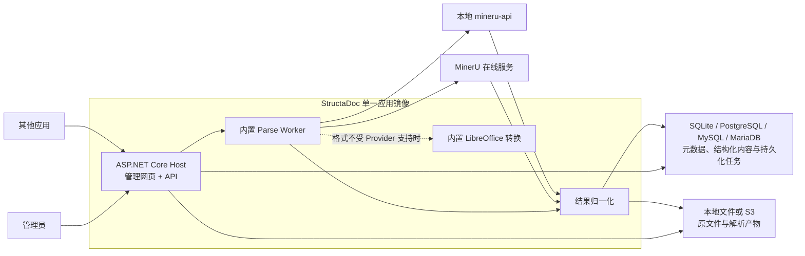

# StructaDoc

> A self-hosted document ingestion and structured parsing service.

[](./LICENSE)
[](#项目状态)

StructaDoc 是一个独立、可自托管的文档摄取与结构化解析服务。管理员可以在管理网页中上传 PDF、Word、Excel、PowerPoint 等文档，并选择由在线 MinerU 服务或本地部署的 MinerU 服务完成解析。解析结果会被归一化为稳定的文档、内容块、图片和原始产物数据，供其他应用通过 HTTP API 调用。

StructaDoc 关注的是从“文件”到“结构化文档数据”的可靠转换。它不要求调用方了解 MinerU 的任务协议、输出目录或不同版本的 JSON 格式。

## 项目状态

StructaDoc 当前处于早期实现阶段，已经提供可编译、可测试和可启动的 .NET 10 Host、健康检查、四种数据库实现、Document 摄取与读取、管理员/API Client 认证，以及版本化 Provider Config 和 Parse Run 创建/状态查询。Parse Run 的原子抢占、续租、失败转换、到期恢复、Provider 执行契约、租约约束的配置快照读取、阶段与外部任务 ID 持久化、Cloud 两阶段上传加密 checkpoint、运行中任务接管、串行化心跳会话、可恢复执行器、受限 LibreOffice Office-to-PDF 回退、MinerU Cloud 签名上传与 Local multipart HTTP 适配、签名传输连接级公共地址策略、Provider ZIP 结果受限接收、Cloud/Local ZIP 到 Canonical Parse Bundle 的确定性归一化，以及 Pages / Blocks / Assets / Artifacts 的幂等成功提交也已实现；包含 LibreOffice 和字体的最终运行时镜像、管理员配置 Base URL 的部署级出站策略、统一结果读取 API、管理员账户管理、文档删除和管理网页尚未实现。实际解析执行默认关闭，只有显式设置 `Worker__ExecutionEnabled=true` 后，执行 Worker 才会抢占队列并产生 Provider 出站请求。本 README 中未明确标记为已实现的业务能力仍表示目标设计。

设计决策和规格入口见 [`docs/README.md`](./docs/README.md)。

## 本地开发

需要安装 .NET 10 SDK。当前工程基线可以通过以下命令验证和启动：

```bash
dotnet restore StructaDoc.slnx
dotnet tool restore
dotnet build StructaDoc.slnx --no-restore
dotnet test StructaDoc.slnx --no-build --no-restore
dotnet run --project src/StructaDoc.Host
```

启动后可访问：

- `GET /api/v1/system/info`：服务身份和版本；
- `GET /health/live`：进程存活检查；
- `GET /health/ready`：服务就绪检查，当前包含数据库连通性和本地文件存储可写性；S3 接入后也必须纳入该检查。
- `GET /api/v1/admin/antiforgery`：获取管理员登录或写操作使用的 antiforgery token；
- `POST /api/v1/admin/session`：管理员登录；
- `GET /api/v1/admin/session`：读取当前管理员会话；
- `DELETE /api/v1/admin/session`：退出管理员会话；
- `GET /api/v1/admin/api-clients`：管理员列出 API Client；
- `POST /api/v1/admin/api-clients`：创建 API Client，并且只在该响应中返回完整 Key；
- `PUT /api/v1/admin/api-clients/{id}`：修改名称与 scope；
- `POST /api/v1/admin/api-clients/{id}/rotate`：轮换 Key，并且只在该响应中返回新 Key；
- `DELETE /api/v1/admin/api-clients/{id}`：不可逆撤销 API Client；
- `GET /api/v1/admin/provider-configs`：管理员列出当前 Provider 配置版本，不返回凭据；
- `POST /api/v1/admin/provider-configs`：创建 Provider 配置及首个不可变版本；
- `PUT /api/v1/admin/provider-configs/{id}`：创建新的不可变配置版本；
- `POST /api/v1/documents`：单文件 `multipart/form-data` 上传，字段名为 `file`；要求管理员会话或具有 `documents:write` 的 API Key。
- `GET /api/v1/documents`：使用 `limit` 和不透明 `cursor` 的稳定键集分页；要求管理员会话或 `documents:read`；
- `GET /api/v1/documents/{id}`：读取 Document 详情；
- `GET /api/v1/documents/{id}/content`：受控下载原文件，支持 ETag、条件请求和字节 Range。
- `POST /api/v1/documents/{id}/parse-runs`：创建持久化 Parse Run；要求管理员会话或 `parses:write`，可使用 `Idempotency-Key`；
- `GET /api/v1/parse-runs/{id}`：读取 Parse Run 状态；要求管理员会话或 `parses:read`。

默认配置使用 `./data/structadoc.db` SQLite 文件并在启动时应用迁移。可以通过环境变量切换数据库：

- `Database__Provider`：`Sqlite`、`PostgreSql`、`MySql` 或 `MariaDb`；
- `Database__ConnectionString`：对应数据库连接字符串；
- `Database__ServerVersion`：MySQL / MariaDB 必填，例如 `8.4.0` 或 `11.4.0`；
- `Database__ApplyMigrationsOnStartup`：是否由 Host 在启动时应用迁移。
- `Worker__Enabled`：是否启用 Parse Run 维护循环；
- `Worker__ExecutionEnabled`：是否启用真实 Parse Run 执行，默认 `false`；启用后会向所选 Provider 发送文档；
- `Worker__MaintenanceInterval`：检查到期抢占和重试的时间间隔；
- `Worker__RecoveryBatchSize`：每轮每类任务的最大恢复数量。
- `Worker__LeaseDuration`：执行租约每次授予或续租后的有效时间；
- `Worker__HeartbeatInterval`：执行期间的续租间隔，必须短于租约有效时间。
- `Worker__RetryDelay`：瞬时执行错误进入 `retry-wait` 后的固定等待时间；
- `Worker__MinimumPollDelay`、`Worker__MaximumPollDelay`：约束 Provider 建议轮询间隔的下限和上限；
- `ProviderResults__MaxArchiveBytes`：Provider ZIP 压缩包大小上限；
- `ProviderResults__MaxEntryCount`：ZIP 最大条目数；
- `ProviderResults__MaxEntryBytes`、`ProviderResults__MaxExpandedBytes`：单条目和总展开字节上限；
- `ProviderResults__MaxCompressionRatio`：单条目最大压缩比；
- `ProviderResults__MaxEntryPathBytes`：ZIP 内部路径 UTF-8 字节上限；
- `ProviderResults__MaxCentralDirectoryBytes`：ZIP 中央目录元数据总大小上限；
- `ProviderResults__TemporaryPath`：存储回读流不可 seek 时使用的受限临时目录。
- `ProviderResultNormalization__MaxMarkdownBytes`、`ProviderResultNormalization__MaxJsonBytes`：单个 Markdown / JSON 派生产物上限；
- `ProviderResultNormalization__MaxAssetBytes`：单个图片 Asset 的流式存储上限；
- `ProviderResultNormalization__TemporaryPath`：归一化读取不可 seek Archive 时的受限临时目录；
- `LibreOffice__Enabled`：是否允许 Office-to-PDF 回退；
- `LibreOffice__ExecutablePath`、`LibreOffice__TemporaryPath`：LibreOffice 可执行文件和隔离工作目录父路径；
- `LibreOffice__MaxConcurrency`、`LibreOffice__Timeout`：转换并发与单次进程时间限制；
- `LibreOffice__MaxInputBytes`、`LibreOffice__MaxOutputBytes`、`LibreOffice__MaxTemporaryBytes`：转换输入、输出和临时磁盘限制；
- `Documents__UploadApiEnabled`：是否映射上传端点，默认 `true`；
- `Documents__MaxUploadBytes`：单个原始文档的最大字节数；
- `Storage__Provider`：当前只实现 `Local`；
- `Storage__RootPath`：原文件存储卷在容器内的根目录。
- `Authentication__DataProtectionKeysPath`：管理员 Cookie 和 antiforgery key ring 的持久化目录；
- `Authentication__AdministratorSessionLifetime`：管理员会话寿命；
- `Authentication__LoginPermitLimit`、`Authentication__LoginRateLimitWindow`：每个来源 IP 的管理员登录尝试限额和固定时间窗口；
- `Authentication__BootstrapAdministratorEmail`、`Authentication__BootstrapAdministratorPassword`：仅通过环境变量或 Secret 注入的首个管理员凭据。

连接字符串、bootstrap 密码和其他凭据必须通过部署 Secret 注入，不得提交到配置文件。当前数据库实现和验证范围见 [`docs/development/database-support.md`](./docs/development/database-support.md)，文件落盘和上传限制见 [`docs/development/file-storage.md`](./docs/development/file-storage.md)，读取和下载语义见 [`docs/development/document-reading.md`](./docs/development/document-reading.md)，Provider 配置与 Parse Run 创建语义见 [`docs/development/provider-config-and-parse-runs.md`](./docs/development/provider-config-and-parse-runs.md)，Provider 执行边界见 [`docs/development/provider-execution.md`](./docs/development/provider-execution.md)，Office 转 PDF 见 [`docs/development/office-conversion.md`](./docs/development/office-conversion.md)，MinerU HTTP 协议与安全边界见 [`docs/development/mineru-http-providers.md`](./docs/development/mineru-http-providers.md)，Provider ZIP 接收见 [`docs/development/provider-result-intake.md`](./docs/development/provider-result-intake.md)，MinerU 结果归一化见 [`docs/development/provider-result-normalization.md`](./docs/development/provider-result-normalization.md)，Canonical 结果提交见 [`docs/development/canonical-result-persistence.md`](./docs/development/canonical-result-persistence.md)，认证细节见 [`docs/development/authentication.md`](./docs/development/authentication.md)。

## 核心目标

- 提供面向管理员的文档上传、管理、解析和结果查看页面。
- 计划支持 PDF、DOC/DOCX、XLS/XLSX、PPT/PPTX。
- 通过异步任务处理耗时较长的文档解析流程。
- 同时适配在线 MinerU API 和自托管 `mineru-api`。
- 解析服务类型、地址、凭据和默认模型只能由管理员配置。
- 保留原始文件、标准化文件、MinerU 原始产物及解析历史。
- 将不同 MinerU 接口的结果归一化为稳定的内部结构。
- 通过版本化 HTTP API 向其他应用提供文档、解析任务、内容块、图片和产物。
- 支持本地文件系统和 S3 兼容对象存储。
- 通过包含管理网页、API、Worker 和 LibreOffice 的单一应用镜像保持部署简单，同时保留以后用同一镜像拆分 API 与 Worker 运行模式的边界。

## 项目边界

第一阶段明确不承担以下职责：

- 不内置全文检索、向量检索、Embedding 或 RAG 管线。
- 不根据文档自动生成题目、词汇、知识点等特定领域数据。
- 不成为 Word、Excel 或 PowerPoint 在线编辑器。
- 不要求其他应用直接读取 StructaDoc 的数据库或对象存储。
- 不把某个 MinerU 版本的原始响应直接作为公共 API 契约。

调用方可以根据自己的业务需要，对 StructaDoc 返回的内容块进行检索、向量化、知识库构建或领域数据提取。

## 工作流程



第一阶段的 API、管理网页、Worker 和 LibreOffice 转换能力由同一个 Host 和应用镜像交付。Worker 以所配置关系数据库中的 Parse Run 为权威任务来源，不使用进程内队列，因此服务重启后仍能按租约恢复执行。SQLite 面向单应用实例的轻量部署；PostgreSQL、MySQL 和 MariaDB 还必须支持多实例 Worker 竞争任务。

## 解析 Provider

StructaDoc 将文档解析能力建模为可替换的 Provider，而不是在业务代码中直接绑定某一种 MinerU 接口。

### MinerU Cloud

在线模式用于调用 MinerU 托管服务：

- 管理员配置 API Base URL、Token、默认模型和解析选项。
- 文档会被发送到管理员配置的外部服务。
- 应使用短时有效的预签名地址或 Provider 提供的上传地址传递文件。
- 管理页面必须明确提示在线解析会产生外部数据传输。

### MinerU Local

本地模式用于连接自托管的 `mineru-api` 或兼容服务：

- 管理员配置服务地址、可选凭据、backend 和解析选项。
- StructaDoc 提交异步任务、轮询状态并及时保存最终产物。
- MinerU 服务自身的临时任务状态不作为 StructaDoc 的权威状态。
- MinerU 服务重启后，StructaDoc 已保存的文档和解析结果不受影响。

### 稳定的内部契约

每个 Provider 最终都要生成统一的 `ParseBundle` 概念：

| 内容 | 说明 |
|---|---|
| Markdown | 适合阅读和导出的完整文档内容 |
| Blocks | 按页码和阅读顺序组织的标题、正文、表格、公式、图片等内容块 |
| Assets | 从文档中提取的图片及其他二进制资源 |
| Layout | 页面、位置和边界框等版面信息 |
| Raw artifacts | Provider 返回的 ZIP、JSON 等原始产物 |
| Provider metadata | 实际 Provider、模型、参数和外部任务标识 |

公共 API 以 StructaDoc 的结构为准。Provider 的原始字段可以保留用于追溯，但不会成为调用方必须依赖的字段。

## 管理员配置

解析 Provider 由管理员统一配置，普通上传者和 API Client 不能修改：

- Provider 类型：MinerU Cloud 或 MinerU Local。
- Base URL 和健康检查地址。
- API Token 或其他凭据。
- 默认模型或 backend。
- OCR、公式、表格、语言等默认选项。
- 超时、并发数和重试策略。
- 启用、停用和默认 Provider。
- 测试连接及能力检查。

敏感凭据不得返回给浏览器，也不得以明文写入日志。数据库只保存加密后的凭据，解密主密钥应由环境变量或部署平台的 Secret 管理能力提供。

解析任务会保存 Provider 和配置版本快照。管理员修改默认 Provider 后，已经进入队列或正在运行的任务仍按创建时的配置执行。

Provider 配置采用不可变版本。修改配置会创建新版本，旧版本在仍被非最终 Parse Run 引用时必须保留；被停用的版本不能用于创建新任务，但已有任务仍可读取其加密配置完成或恢复执行。

## Office 文档处理

StructaDoc 始终保存用户上传的原始文件。当前执行器采用以下策略：

1. Provider 原生支持该格式时，优先直接提交原文件。
2. Provider 不支持该格式时，由镜像内置的 LibreOffice headless 转换适配器生成 PDF。
3. 转换后的 PDF 作为独立产物保存，不覆盖原文件。
4. 解析记录保存源格式、实际提交格式、LibreOffice 版本、大小、哈希和转换参数，保证结果可追溯与恢复。

这种方式可以让本地 MinerU 直接处理其支持的 DOCX、PPTX、XLSX，同时为不支持 Excel 的在线接口提供 PDF 回退方案。

转换由 .NET 直接启动受限的 LibreOffice 子进程，不运行 Python、FastAPI 或内部转换 HTTP 服务。每次转换使用独立临时目录和 LibreOffice User Profile，并受到并发数、超时、输入大小、输出大小和临时磁盘限制。当前适配器和恢复语义见 [`office-conversion.md`](./docs/development/office-conversion.md)，具体部署决策见 [`ADR-0003`](./docs/adr/0003-technology-and-single-image-deployment.md)。最终运行时镜像和字体层仍待实现。

## 数据模型

计划中的主要实体如下：

| 实体 | 职责 |
|---|---|
| Document | 原文件名称、类型、大小、哈希、存储位置和上传信息 |
| Parse Run | 一次解析执行的状态、Provider、参数快照、重试和时间信息 |
| Block | 页码、阅读顺序、类型、正文、边界框、置信度和原始块数据 |
| Asset | 解析图片及其与内容块的关联 |
| Artifact | Markdown、标准化 PDF、ZIP、layout/model/content-list 等产物引用 |
| Provider Config | 管理员维护的解析服务配置和加密凭据 |
| API Client | 其他应用使用的访问凭据、权限范围和状态 |
| Audit Log | 配置修改、删除、重试等管理操作记录 |

SQLite、PostgreSQL、MySQL 或 MariaDB 保存业务元数据和需要查询的结构化内容块。原文件、图片、ZIP 和大型 JSON 等二进制或大体积产物保存到本地文件系统或 S3 兼容对象存储，数据库保存引用、哈希、大小和内容类型。数据库选择不改变公共 API 和领域语义。

对象存储内部引用不会通过公共 API 暴露。调用方通过 StructaDoc 资源 ID 和受控下载端点获取文件或短时下载 URL。

## 异步任务与可靠性

文档解析必须使用持久化异步任务，而不是让上传请求一直等待：

- API 创建 `queued` 状态的 Parse Run。
- Host 内置的 Worker 使用数据库原子抢占任务，避免多实例重复执行。
- 运行中的任务保存租约、心跳和尝试次数。
- 短暂网络错误可以自动重试，永久错误保留明确的错误码和诊断信息。
- Provider 外部任务 ID 与 StructaDoc Parse Run ID 分离。
- 重试创建新的执行尝试，已经成功的历史结果保持可追溯。
- Provider 结果必须在标记成功前完整持久化。

## HTTP API 草案

公共契约会使用版本化路径。以下路径用于说明计划边界，最终请求和响应格式将在实现前单独定义。

### 文档与解析

```text
POST   /api/v1/documents
GET    /api/v1/documents
GET    /api/v1/documents/{documentId}
GET    /api/v1/documents/{documentId}/content
DELETE /api/v1/documents/{documentId}

POST   /api/v1/documents/{documentId}/parse-runs
GET    /api/v1/parse-runs/{parseRunId}
GET    /api/v1/parse-runs/{parseRunId}/blocks
GET    /api/v1/parse-runs/{parseRunId}/assets
GET    /api/v1/parse-runs/{parseRunId}/artifacts
```

### 调用方认证

管理网页会话与应用调用凭据相互独立。当前管理员使用 Cookie 会话，其他应用使用 `Authorization: ApiKey <credential>` 调用，并使用最小权限范围，例如：

- `documents:read`
- `documents:write`
- `parses:read`
- `parses:write`

调用方不需要也不允许复用管理员浏览器 Cookie。管理员可以通过 `/api/v1/admin/api-clients` 创建、列出、修改 scope、轮换和撤销 API Client；创建或轮换返回的完整 Key 只显示一次，服务端无法恢复。

## 计划技术栈

| 部分 | 计划技术 |
|---|---|
| Host / API / Worker | .NET 10、ASP.NET Core 10 |
| 管理网页 | Vue 3、TypeScript、Vite |
| 业务数据库 | SQLite、PostgreSQL、MySQL / MariaDB；EF Core 通用模型与数据库方言适配层 |
| 文件与产物 | 本地文件系统或 S3 兼容对象存储 |
| Office 转换 | .NET 本地适配器调用镜像内置 LibreOffice headless |
| 文档解析 | MinerU Cloud / MinerU Local Provider |
| 部署 | 单一 StructaDoc 应用镜像；SQLite 使用持久卷，服务端数据库独立运行 |

StructaDoc 是独立项目，不依赖 Ruoyu.Study、QuantumZhou.Identity、Consul 或其共享代码。通用 OIDC、对象存储和配置实现将由本仓库自行定义。

最终运行时镜像不包含 Node.js、.NET SDK 或 Python。Node.js 和 .NET SDK 只用于多阶段构建；管理网页编译后由 ASP.NET Core Host 提供静态文件。

## 计划目录结构

```text
StructaDoc/
├── src/
│   ├── StructaDoc.Host/
│   ├── StructaDoc.Contracts/
│   ├── StructaDoc.Application/
│   ├── StructaDoc.Domain/
│   ├── StructaDoc.Infrastructure/
│   ├── StructaDoc.Providers.Abstractions/
│   ├── StructaDoc.Providers.MinerUCloud/
│   ├── StructaDoc.Providers.MinerULocal/
│   ├── StructaDoc.Worker/
│   └── StructaDoc.Conversion.LibreOffice/
├── web/
├── deploy/
├── docs/
└── tests/
```

`StructaDoc.Host` 是第一阶段唯一的可执行项目；`StructaDoc.Worker` 和转换项目是由 Host 加载的逻辑组件，不单独发布镜像。目录会随首个可运行版本调整；在对应代码出现前不会创建空的占位项目。

## 路线图

### Phase 0：契约与验证样本

- 确定统一的 Document、Parse Run、Block、Asset 和 Artifact 契约。
- 收集覆盖 PDF、Word、Excel、PowerPoint 的可公开测试样本。
- 对比在线与本地 MinerU 的输出差异。
- 确定文件大小、页数、超时和保留策略。

### Phase 1：最小可运行版本

- 管理员登录和 Provider 配置。
- 文档上传、列表、详情和删除。
- MinerU Cloud / Local Provider。
- Host 内置的持久化异步 Worker。
- SQLite、PostgreSQL、MySQL / MariaDB 持久化实现与本地文件存储。
- 各数据库的迁移、任务抢占和生命周期契约测试。
- Markdown、Block、图片和原始产物查看。

### Phase 2：应用集成与部署

- API Client 与权限范围。
- S3 兼容对象存储。
- 包含管理网页、API、Worker 和 LibreOffice 的单一应用镜像。
- 内置 Office 转换适配器。
- Docker Compose 部署示例：SQLite 单容器模式，以及 PostgreSQL、MySQL、MariaDB 外部数据库模式。
- API 文档、健康检查、审计和备份说明。

### Phase 3：可靠性与扩展

- 多 Worker、任务租约和并发控制。
- 同一镜像按全部功能、仅 API 或仅 Worker 模式启动。
- Webhook 通知。
- Provider 能力发现与配置版本管理。
- 更完善的可观测性、数据保留和灾难恢复。

## 安全原则

- 不信任上传请求声明的 MIME 类型，应结合扩展名和文件内容检测。
- 限制文件大小、页数、处理时间、CPU、内存和临时磁盘使用。
- 文档转换器和本地 MinerU 默认只在内部网络暴露。
- 对外部 URL、回调地址和预签名地址实施 SSRF 防护与有效期限制。
- API Token、Provider Token 和存储凭据不得写入日志。
- 删除文档时需要清理数据库记录和关联存储产物，并保留审计记录。
- 在线 Provider 的数据传输行为必须对管理员清晰可见。

## MinerU 说明

StructaDoc 不是 MinerU 官方项目，也不会复制或维护 MinerU 源码。MinerU 仅作为可配置的外部解析 Provider 使用。

使用 MinerU 时，请遵守其当前的 [MinerU Open Source License](https://github.com/opendatalab/MinerU/blob/master/LICENSE.md) 和在线服务条款。根据其许可证要求，基于 MinerU 向第三方提供在线服务时，应在产品界面或公开文档中清晰标明使用了 MinerU。

## 参与贡献

项目仍处于早期阶段。在提交实现前，建议先通过 Issue 讨论以下类型的变更：

- 公共 API 或数据结构变更。
- 新的文档解析 Provider。
- 认证和权限模型。
- 存储、任务执行和部署架构。
- 会显著增加默认部署复杂度的依赖。

缺陷修复、测试、文档改进和小范围重构可以直接提交 Pull Request。

## License

StructaDoc 使用 [Apache License 2.0](./LICENSE) 许可证。
