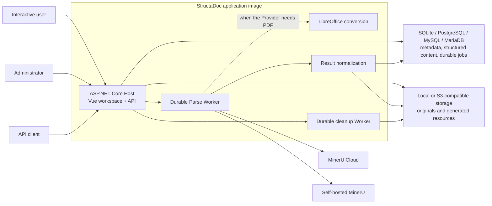

# StructaDoc

> A self-hosted document ingestion and structured parsing service.

[](./LICENSE)
[](#project-status)

StructaDoc turns uploaded documents into stable, structured data. It combines a user-facing Vue workspace, a controlled administration area, a versioned HTTP API, durable background processing, and local or S3-compatible storage in one self-hostable application.

Users can upload and manage PDF, Word, Excel, and PowerPoint files; start parsing; inspect normalized pages, blocks, assets, and Markdown; share documents; and export Markdown, HTML, ZIP, or PDF. Administrators additionally manage parsing Providers and API clients.

MinerU Cloud and self-hosted MinerU are adapters behind a Provider-neutral boundary. Consumers never need to understand Provider task protocols, output layouts, or version-specific raw JSON.

## Project Status

StructaDoc is in early development, but the main end-to-end platform is implemented:

- Vue 3 user workspace and administration area;
- generic OpenID Connect authentication using `(issuer, subject)` as the stable external identity;
- optional local break-glass administrator and separate scoped API-client credentials;
- document ownership, explicit sharing, and resource-level authorization;
- Local and S3-compatible storage;
- SQLite, PostgreSQL, MySQL, and MariaDB persistence;
- immutable Provider configuration versions and durable Parse Runs;
- atomic claims, leases, heartbeats, retries, cancellation, and crash recovery;
- MinerU Cloud signed upload and MinerU Local multipart adapters;
- constrained LibreOffice Office-to-PDF fallback;
- resumable large-PDF segmentation and deterministic result merging;
- bounded Provider ZIP intake and deterministic canonical normalization;
- stable result DTOs, authorized downloads, Markdown preview, and exports;
- persistent cleanup jobs that complete object deletion before removing relational data.

The production Docker image, PostgreSQL/MySQL/MariaDB contract suites, and Chromium workspace smoke test are exercised by GitHub Actions. Real parsing is disabled by default: a Worker sends documents to a configured Provider only when `Worker__ExecutionEnabled=true` is set explicitly.

See the [documentation index](./docs/README.md) for architecture decisions, specifications, implementation notes, and deployment guidance.

## Product Boundary

StructaDoc owns the reliable conversion from files to normalized document data:

1. ingest and retain original documents;
2. create and execute durable asynchronous Parse Runs;
3. integrate external or local parsing Providers;
4. normalize Provider output into Documents, Pages, Blocks, Assets, and Artifacts;
5. retain parsing history and raw results for traceability;
6. expose versioned APIs and a user-facing workspace.

StructaDoc intentionally does not include:

- full-text search or OpenSearch;
- vector search, embeddings, or RAG pipelines;
- LLM-generated metadata or domain entities such as questions, vocabulary, invoice records, or contract records;
- online editing for Office documents;
- direct consumer access to its database or object storage;
- raw Provider JSON as a stable public contract.

Consumers may build search, vectorization, knowledge bases, or domain extraction on top of StructaDoc's versioned output.

## Local Development

Install the .NET 10 SDK and Node.js 24, then run:

```bash
dotnet restore StructaDoc.slnx
dotnet tool restore

cd web
npm ci
npm run build
cd ..

dotnet build StructaDoc.slnx --no-restore
dotnet test StructaDoc.slnx --no-build --no-restore
dotnet run --project src/StructaDoc.Host
```

The Host serves the compiled web application and API. Useful unauthenticated endpoints are:

- `GET /api/v1/system/info` — service identity and version;
- `GET /health/live` — process liveness;
- `GET /health/ready` — database and storage readiness.

For CI coverage and local reproduction, see [Continuous Integration](./docs/development/continuous-integration.md).

## Single-Container Start

The root `Dockerfile` builds the Vue application and .NET Host, then creates one non-root runtime image containing ASP.NET Core, LibreOffice no-GUI components, and common fonts. `compose.yaml` starts one application container backed by a named SQLite volume.

Set the bootstrap administrator secret and start the service:

```bash
export STRUCTADOC_ADMIN_EMAIL='admin@example.com'
export STRUCTADOC_ADMIN_PASSWORD='use-a-secret-manager-or-a-long-random-value'
docker compose up --build --detach
```

PowerShell:

```powershell
$env:STRUCTADOC_ADMIN_EMAIL = 'admin@example.com'
$env:STRUCTADOC_ADMIN_PASSWORD = 'use-a-secret-manager-or-a-long-random-value'
docker compose up --build --detach
```

The default address is `http://localhost:8080`. The example values show the required shape and are not default credentials. Inject production secrets through the deployment platform and remove bootstrap credentials after the first administrator exists.

For restricted networks, the repository includes explicit `official`, `china`, and connectivity-based `auto` build modes:

```bash
bash ./scripts/build-container.sh auto
docker compose up --detach --no-build
```

```powershell
powershell -NoProfile -ExecutionPolicy Bypass -File ./scripts/build-container.ps1 -MirrorMode Auto
docker compose up --detach --no-build
```

Review [Single-Container Deployment](./docs/deployment/single-container.md) for image contents, mirror trust, non-root permissions, persistent data, backup requirements, and runtime limits.

## Architecture



The Worker uses the configured relational database as the authoritative queue. It does not rely on an in-process queue, so work can resume from stored leases and checkpoints after a restart. SQLite supports one StructaDoc instance; server databases support multiple competing Worker instances.

## Identity and Authorization

Interactive users authenticate through configurable OIDC Authorization Code flow with PKCE. StructaDoc depends on standard discovery, token validation, and claim mapping, not on a Provider-specific SDK. SignaCore, Keycloak, Authentik, Entra ID, and other standards-compliant Providers can be used without changing business code.

The stable identity key is `(issuer, subject)`. Email and display name are presentation attributes, not authorization keys. OIDC tokens remain in the Host; browser JavaScript receives only an encrypted HttpOnly application session.

The local administrator remains available for bootstrap and break-glass recovery. Machine clients use separate API keys with explicit scopes:

- `documents:read`
- `documents:write`
- `parses:read`
- `parses:write`

See [User Workspace and OIDC](./docs/development/user-workspace-oidc.md) and [Authentication](./docs/development/authentication.md).

## Provider and Result Model

Provider configuration is administrator-controlled and immutable by version. Each Parse Run snapshots its Provider type, configuration version, model/backend, and non-sensitive options. Changing the default Provider never changes existing work.

When a Provider supports the source format, StructaDoc submits the original. Otherwise, if the source is a supported Office format and the Provider accepts PDF, the constrained LibreOffice adapter creates a separate `normalized-pdf` Artifact. The original is never overwritten.

Every successful Provider result becomes a canonical Parse Bundle containing:

| Content | Purpose |
|---|---|
| Pages | Provider-neutral page identity and dimensions |
| Blocks | Ordered text, headings, tables, formulas, images, and other content |
| Assets | Extracted images and binary resources |
| Artifacts | Markdown, normalized PDF, Provider archive, layout, and model output |
| Provider metadata | Sanitized Provider, model, and option facts |

Raw ZIP and JSON may be retained as authorized Artifacts, but raw fields never become the public Block contract. See the [Canonical Document Model](./docs/specifications/canonical-document-model.md).

## Public API Overview

The versioned API includes:

```text
POST   /api/v1/documents
GET    /api/v1/documents
GET    /api/v1/documents/{documentId}
GET    /api/v1/documents/{documentId}/content
DELETE /api/v1/documents/{documentId}

POST   /api/v1/documents/{documentId}/parse-runs
GET    /api/v1/documents/{documentId}/parse-runs
GET    /api/v1/parse-runs/{parseRunId}
POST   /api/v1/parse-runs/{parseRunId}/cancel
GET    /api/v1/parse-runs/{parseRunId}/pages
GET    /api/v1/parse-runs/{parseRunId}/blocks
GET    /api/v1/parse-runs/{parseRunId}/assets
GET    /api/v1/parse-runs/{parseRunId}/artifacts
GET    /api/v1/parse-runs/{parseRunId}/markdown
GET    /api/v1/parse-runs/{parseRunId}/exports/{format}
```

Content is retrieved through authorized endpoints; internal `storageRef` values never appear in public DTOs. Parse Run creation supports `Idempotency-Key`. Block listing uses stable sequence pagination. Deletion returns an accepted lifecycle transition and is completed by a durable cleanup job.

Cancellation is best-effort and idempotent: it stops local processing and durably completes as `cancelled`, which is also how a Document is released for deletion when its Parse Run will never finish on its own. Because the current MinerU protocols expose no single-task cancellation contract, work already submitted to an online Provider may keep consuming remote resources.

Administrator endpoints manage local sessions, API clients, and Provider configurations under `/api/v1/admin`. Cookie-authenticated writes require an antiforgery token; API-key requests do not use browser cookies and are authorized by scope.

## Key Configuration

Configuration uses standard ASP.NET Core keys; environment variables replace `:` with `__`.

| Area | Important keys |
|---|---|
| Database | `Database__Provider`, `Database__ConnectionString`, `Database__ServerVersion`, `Database__ApplyMigrationsOnStartup` |
| Worker | `Worker__Enabled`, `Worker__ExecutionEnabled`, `Worker__MaxConcurrency`, `Worker__MaxExecutionDuration`, lease, heartbeat, retry, and polling limits |
| Storage | `Storage__Provider`, `Storage__RootPath`, S3 endpoint, bucket, prefix, region, and credential settings |
| Documents | `Documents__UploadApiEnabled`, `Documents__MaxUploadBytes` |
| OIDC | `Oidc__Enabled`, `Oidc__Authority`, `Oidc__ClientId`, `Oidc__ClientSecret`, scopes and role mapping |
| Local administration | bootstrap credentials, session lifetime, login limits, and Data Protection key path under `Authentication__*` |
| Conversion | executable, concurrency, timeout, and byte/disk limits under `LibreOffice__*` |
| Provider results | archive, entry, expansion, compression-ratio, and normalization limits |

Connection strings, bootstrap passwords, OIDC secrets, Provider tokens, and storage credentials must come from deployment secrets, never committed configuration.

## Technology

| Component | Technology |
|---|---|
| Host, API, and Workers | .NET 10 and ASP.NET Core 10 |
| Web workspace | Vue 3, TypeScript, and Vite |
| Persistence | EF Core with SQLite, PostgreSQL, MySQL, and MariaDB migrations |
| File storage | Local filesystem or S3-compatible object storage |
| Office conversion | Constrained LibreOffice headless subprocess |
| Parsing | MinerU Cloud and MinerU Local Provider adapters |
| Deployment | One StructaDoc image; SQLite volume or external server database |

The runtime image does not contain Node.js, the .NET SDK, or Python. Build tools exist only in multi-stage build stages.

StructaDoc is independent of Ruoyu.Study, SignaCore, Consul, and their internal models. It defines its own generic OIDC, storage, parsing, and public API boundaries.

## Security Principles

- Detect file type from content and structure; do not trust client MIME types.
- Bound file size, pages, processing time, memory, temporary disk, archive expansion, and conversion concurrency.
- Keep Provider, OIDC, storage, and API credentials out of logs and responses.
- Apply SSRF controls to Provider URLs and signed transfer URLs.
- Make external data transfer through online Providers visible to administrators and users.
- Authorize every document, result, Asset, Artifact, export, share, and deletion operation at resource level.
- Back up the database, object storage, and Data Protection key ring as one recoverable set.

## MinerU Notice

StructaDoc is not an official MinerU project and does not copy or maintain MinerU source code. MinerU is used only as a configurable external parsing Provider.

When using MinerU, follow its current [open-source license](https://github.com/opendatalab/MinerU/blob/master/LICENSE.md) and service terms. If MinerU is used to provide an online service to third parties, follow its attribution requirements in the product UI or public documentation.

## Contributing

Discuss changes to public APIs, the canonical model, parsing Providers, authentication, storage, job execution, or deployment architecture before implementation. Bug fixes, tests, documentation improvements, and small behavior-preserving refactors are welcome as pull requests.

## License

StructaDoc is licensed under the [Apache License 2.0](./LICENSE).
