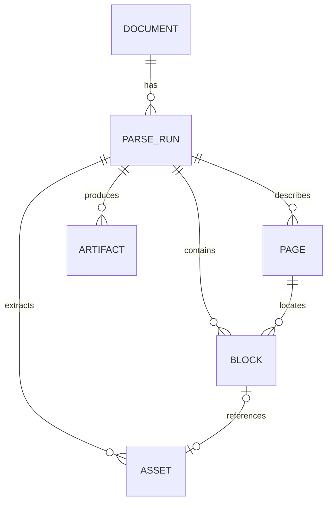

# Canonical Document Model

- Status: Implemented specification
- Version: 1.0-draft
- Last updated: 2026-08-25
- Pending transition: ADR-0009 actor persistence is target behavior until #35 is
  implemented

## 1. Purpose

This specification defines the Provider-neutral structured document semantics shared by StructaDoc Providers, persistence, the web workspace, and the public API.

MinerU Cloud, MinerU Local, and future Provider outputs map to this model before consumers receive them. Raw Provider artifacts may be retained for traceability, but they never replace the canonical model or become a stable public contract.

The current implementation persists and reads Documents, Parse Runs, Pages, Blocks, Assets, and Artifacts; validates and commits Parse Bundles idempotently; normalizes observed MinerU layouts; and exposes authorized result, content, Markdown, and export routes.

## 2. Design Principles

1. **Provider-neutral:** fields do not depend on a MinerU API version.
2. **Traceable:** canonical content links to its Parse Run, original, and retained artifacts.
3. **Loss-aware:** information that cannot be normalized remains in a Raw Artifact rather than disappearing silently.
4. **Extensible:** consumers tolerate unknown Block types and additive optional fields.
5. **Stable ordering:** every Block has one global reading sequence even when reliable physical pages do not exist.
6. **No domain inference:** the model describes document structure, not questions, knowledge points, invoice entities, or other domain output.

### 2.1 Internal and Public Fields

The model covers normalization, persistence, and API semantics, but not every internal field is serializable:

- `storageRef` is internal and never appears in public DTOs;
- public access uses StructaDoc resource IDs and authorized content endpoints;
- `providerData` is an explicitly unstable, bounded, sanitized extension and is absent from ordinary list DTOs;
- Provider tokens, presigned URL queries, internal paths, checkpoints, external task IDs, and database keys are never public;
- API DTOs are explicit projections and do not serialize persistence entities directly.

## 3. Relationships



A Document may be parsed repeatedly with different Providers, models, or options. Each Parse Run owns its own Pages, Blocks, Assets, and Artifacts and never overwrites historical results.

## 4. Identifiers and Time

- StructaDoc resources use opaque UUIDs; database-generated integers and Provider IDs are not public identifiers.
- An external Provider task ID is Parse Run integration metadata only.
- Time uses UTC semantics and is emitted as ISO 8601 with an offset.
- Storage paths are not resource IDs and consumers must not depend on their shape.

## 5. Document

A Document represents the immutable original managed by StructaDoc.

| Field | Required | Semantics |
|---|---|---|
| `id` | Yes | StructaDoc Document ID |
| `originalFileName` | Yes | Sanitized display name; never a storage path |
| `mediaType` | Yes | Server-detected media type |
| `extension` | Yes | Normalized lowercase extension |
| `sizeBytes` | Yes | Original bytes |
| `sha256` | Yes | Lowercase original-content hash |
| `storageRef` | Internal | Storage reference excluded from public APIs |
| `createdBy` | No | Internal actor audit fact; target persistence under [ADR-0009](../adr/0009-canonical-persisted-actor-identity.md) uses a canonical `(issuer, subject)` pair for new rows and an exact opaque payload for migrated rows |
| `owner` | No | External owner identified by `(issuer, subject)` |
| `createdAt` | Yes | Creation time |

### Invariants

- Conversion output never overwrites the original.
- A user filename never participates in a server path.
- Client-declared MIME type is not authoritative.
- A Document has no caller-defined business metadata; consumers keep their own keys against its
  stable ID unless a future version defines an explicit contract for them.
- Physical content deduplication, if introduced, does not merge distinct Document resources.
- Deletion-pending Documents are unavailable to ordinary reads.
- `createdBy` is not exposed by the current `/api/v1` `DocumentResponse`; its
  canonical pair and legacy compatibility payload are persistence details, not
  public storage fields.

## 6. Parse Run

A Parse Run is one immutable parsing intent and its execution outcome.

| Field | Required | Semantics |
|---|---|---|
| `id` | Yes | StructaDoc Parse Run ID |
| `documentId` | Yes | Target Document |
| `status` | Yes | Stable value from the Parse Job Lifecycle |
| `stage` | No | Diagnostic progress, not final-state authority |
| `providerType` | Yes | For example `mineru-cloud` or `mineru-local` |
| `providerConfigId` | Yes | Logical administrator configuration |
| `providerConfigVersion` | Yes | Immutable configuration version snapshot |
| `options` | Yes | Sanitized OCR/table/formula/language and parsing options |
| `sourceMediaType` | Yes | Original media type |
| `submittedMediaType` | Yes | Media type actually submitted to the Provider |
| `conversion` | No | Converter snapshot and converted Artifact ID |
| `externalTaskId` | Internal | Provider task ID; excluded from public APIs |
| `attemptCount` | Yes | Started execution attempts |
| `errorCode` | No | Stable machine-readable StructaDoc code |
| `errorMessage` | No | Sanitized human-readable diagnosis |
| `createdAt` | Yes | Creation time |
| `startedAt` | No | First execution start |
| `completedAt` | No | Final-state time |

Credentials never enter `options` or public responses.

When present, `conversion` includes:

- `converterType`, currently `libreoffice`;
- actual `converterVersion`;
- `sourceMediaType` and `outputMediaType`;
- the same-Parse-Run `normalized-pdf` Artifact ID;
- bounded non-sensitive parameters without temporary directories, command paths, or host details.

This snapshot explains and resumes conversion; it never permits caller-supplied commands.

## 7. Page and Source Location

| Field | Required | Semantics |
|---|---|---|
| `number` | Yes | One-based StructaDoc page number |
| `width` | No | Provider-reported width |
| `height` | No | Provider-reported height |
| `unit` | No | Original dimension unit such as `point` or `pixel` |
| `sourceLocator` | No | Sheet, slide, section, or Provider-native page location |

Not every Office result has a reliable physical page. In that case:

- Block `pageNumber` is `null`;
- global Block `sequence` remains mandatory;
- sheet, slide, or section information belongs in structured `sourceLocator`;
- the normalizer does not invent a physical page.

## 8. Block

A Block is the main structured content unit in the public API.

| Field | Required | Semantics |
|---|---|---|
| `id` | Yes | Block ID |
| `parseRunId` | Yes | Owning Parse Run |
| `sequence` | Yes | Zero-based contiguous reading order across the complete run |
| `pageNumber` | No | One-based StructaDoc page |
| `type` | Yes | Lowercase primary token |
| `subtype` | No | More specific Provider-neutral token |
| `content` | No | Primary text or structured string |
| `contentFormat` | No | `plain`, `markdown`, `html`, `latex`, or another registered format |
| `bbox` | No | Normalized page bounding box |
| `confidence` | No | Normalized 0–1 confidence |
| `assetId` | No | Referenced same-run Asset |
| `sourceLocator` | No | Sheet, slide, section, or similar source location |
| `providerData` | Internal/unstable | Bounded diagnostic extension, excluded from ordinary DTOs |

### Registered Block Types

- `title`
- `text`
- `list`
- `table`
- `formula`
- `image`
- `code`
- `header`
- `footer`
- `footnote`
- `unknown`

The set may grow within the same API major version. Consumers treat unknown types as displayable or ignorable Blocks rather than failing deserialization.

### Reading Order

- `sequence` is the only stable ordering across pages and types.
- Provider-local page order maps to one global sequence.
- Sequence is unique and contiguous within a Parse Run.
- A raw Provider ordering value may be retained internally but is never the public sort key.

## 9. Bounding Box

Public `bbox` uses Provider-neutral normalized coordinates:

```json
{
  "x0": 0.125,
  "y0": 0.240,
  "x1": 0.875,
  "y1": 0.420
}
```

- The origin is the top-left corner.
- `x` increases rightward and `y` downward.
- `0 <= x0 <= x1 <= 1` and `0 <= y0 <= y1 <= 1`.
- Emit a box only when it can be related to reliable page dimensions or a validated Provider-normalized coordinate system.
- Preserve original coordinates and conversion evidence in a Layout Raw Artifact or sanitized internal extension.
- Never manufacture apparently precise values from unverifiable heuristics.

## 10. Asset

An Asset is an extracted image or other binary resource.

| Field | Required | Semantics |
|---|---|---|
| `id` | Yes | Asset ID |
| `parseRunId` | Yes | Owning Parse Run |
| `name` | Yes | Normalized display name |
| `mediaType` | Yes | Server-confirmed media type |
| `sizeBytes` | Yes | Bytes |
| `sha256` | Yes | Content hash |
| `storageRef` | Internal | Storage reference excluded from public APIs |
| `width` / `height` | No | Pixel dimensions |
| `createdAt` | Yes | Creation time |

Public access uses an authorized content endpoint, never a permanent storage path.

## 11. Artifact

An Artifact is Parse Run output that is unsuitable for a Block or is retained as a larger file.

Registered types include:

- `normalized-pdf`
- `markdown`
- `provider-archive`
- `content-list`
- `layout`
- `model-output`
- `provider-raw`

Internally an Artifact contains at least `id`, `parseRunId`, `type`, `name`, `mediaType`, `sizeBytes`, `sha256`, `storageRef`, and `createdAt`, plus bounded type-specific metadata. A `normalized-pdf` records converter type/version and source media type.

One Parse Run may contain multiple Artifacts of one type; name or segment identity distinguishes them. Never represent a multi-part result by silently keeping only its first part.

## 12. Parse Bundle

A Parse Bundle is an internal normalization exchange object, not one database table:

```json
{
  "schemaVersion": "1.0",
  "parseRunId": "00000000-0000-0000-0000-000000000000",
  "pages": [],
  "blocks": [],
  "assets": [],
  "artifacts": [],
  "providerMetadata": {
    "providerType": "mineru-local",
    "model": "example-model"
  }
}
```

The complete bundle must validate and persist before the Parse Run becomes `succeeded`.

## 13. Versioning

- `schemaVersion` is `major.minor`.
- Additive optional fields and Block types increment minor semantics.
- Removed fields or changed field, coordinate, or ordering meaning requires a major version.
- API and Parse Bundle majors may evolve independently, but the API declares the semantics it returns.
- Raw Artifacts have no structural compatibility promise; record their Provider and version facts.

## 14. Validation Requirements

At minimum, a normalized result satisfies:

- referenced Document and Parse Run exist;
- Block sequence is unique, contiguous, and in reading order;
- `pageNumber` is `null` or at least 1;
- every bounding box and confidence value satisfies its normalized range;
- `assetId` references an Asset in the same Parse Run;
- a conversion Artifact ID references a same-run `normalized-pdf`;
- Asset and Artifact hash and size match actual stored objects;
- extensions do not contain credentials, signed URL queries, internal paths, or other sensitive values;
- the Parse Run is marked successful only in the same transaction that accepts the full canonical result.

## 15. Evolution Work

Future additive work may define richer Artifact metadata keys, more Office sheet/slide/section locators, more Provider fixture versions, and additional registered Block types. Any incompatible public meaning follows the versioning rules above rather than leaking a Provider schema into the contract.
