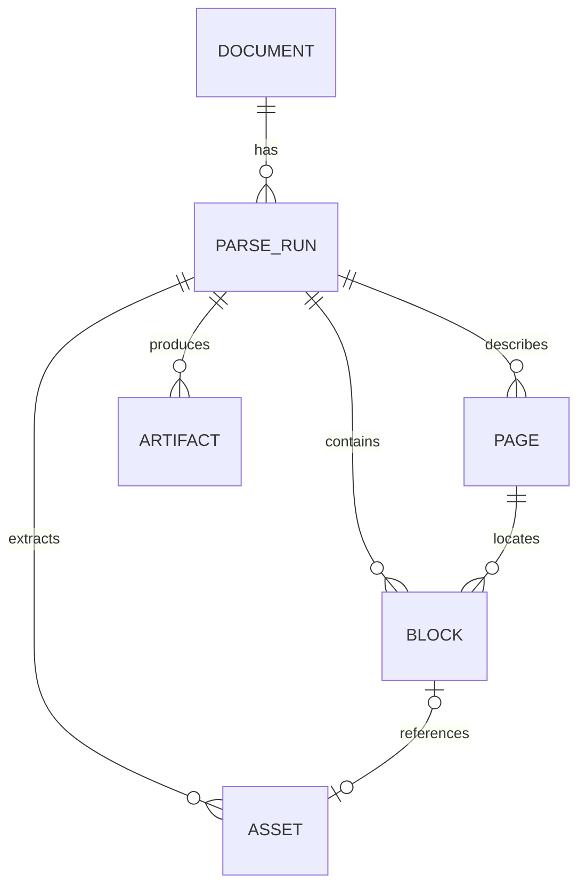

# Canonical Document Model

- Status: Target specification
- Version: 1.0-draft
- Last updated: 2026-08-05

## 1. Purpose

本规格定义 StructaDoc 在 Provider、数据库、管理网页和公共 API 之间共享的统一结构化文档语义。它是完整目标契约；当前已实现 Document 持久化与读取，以及 Parse Bundle、Page、Block、Asset、Artifact 的验证和幂等成功提交。统一结果的公共读取 DTO、下载端点和 Provider 归一化器仍未实现。

MinerU Cloud、MinerU Local 和未来 Provider 的输出必须先映射到本模型，再提供给调用方。Provider 原始产物可以保留，但不能替代本模型。

## 2. Design Principles

1. **Provider-neutral**：字段不依赖某个 MinerU API 版本。
2. **Traceable**：统一字段可以追溯到 Parse Run、原文件和原始产物。
3. **Loss-aware**：无法统一的信息保留在 Raw Artifact，不静默丢弃。
4. **Extensible**：调用方必须允许未知 Block 类型和新增可选字段。
5. **Stable ordering**：即使文档没有可靠页码，也必须具有全局阅读顺序。
6. **No domain inference**：模型表达文档结构，不表达题目、知识点等领域实体。

### 2.1 Internal and Public Fields

本模型同时描述归一化、持久化和公共 API 所需的语义，但并非每个内部字段都可以直接序列化给调用方：

- `storageRef` 是内部持久化字段，公共 API 不返回其值；
- 公共 API 使用 StructaDoc 资源 ID、受控下载端点或短时下载 URL；
- `providerData` 是显式非稳定扩展，默认不进入普通列表响应，且必须经过大小限制和敏感信息清理；
- Provider Token、预签名 URL 查询参数、内部文件路径和数据库键不得进入公共响应；
- API DTO 只能公开本规格明确允许的语义，不能直接复用持久化实体进行序列化。

## 3. Relationships



一个 Document 可以被不同 Provider、模型或参数解析多次。每个 Parse Run 拥有自己的 Pages、Blocks、Assets 和 Artifacts，不覆盖历史结果。

## 4. Identifiers and Time

- StructaDoc 资源使用不透明 UUID，不把数据库自增值或 Provider 外部 ID 暴露为主标识。
- Provider 外部任务 ID 仅属于 Parse Run 集成元数据。
- 所有时间使用 UTC，并通过 ISO 8601 带时区格式输出。
- 存储路径不是公共资源 ID，调用方不应依赖其格式。

## 5. Document

Document 表示用户上传并由 StructaDoc 管理的原始文件。

| Field | Required | Semantics |
|---|---|---|
| `id` | Yes | StructaDoc Document ID |
| `originalFileName` | Yes | 用户上传时的文件名，仅用于展示，不作为存储路径 |
| `mediaType` | Yes | 经服务端检测后的媒体类型 |
| `extension` | Yes | 归一化的小写扩展名 |
| `sizeBytes` | Yes | 原文件字节数 |
| `sha256` | Yes | 原文件内容哈希，小写十六进制 |
| `storageRef` | Yes | 仅内部使用的存储引用，不进入公共 API |
| `createdBy` | No | 上传者或 API Client 标识 |
| `createdAt` | Yes | 创建时间 |
| `metadata` | No | 调用方提供的非敏感自定义键值，受大小和键名限制 |

### Invariants

- 原始文件不可被转换产物覆盖。
- 文件名不能参与服务端路径拼接。
- 客户端声明的媒体类型不是权威值。
- 相同 SHA-256 是否去重属于后续存储策略；即使物理复用，也必须保留独立 Document 语义。

## 6. Parse Run

Parse Run 表示对一个 Document 的一次不可变解析意图及其执行结果。

| Field | Required | Semantics |
|---|---|---|
| `id` | Yes | StructaDoc Parse Run ID |
| `documentId` | Yes | 被解析的 Document |
| `status` | Yes | 见 Parse Job Lifecycle |
| `stage` | No | 当前内部阶段，用于诊断，不替代稳定状态 |
| `providerType` | Yes | 例如 `mineru-cloud`、`mineru-local` |
| `providerConfigId` | Yes | 创建任务时选用的管理员配置 |
| `providerConfigVersion` | Yes | 配置版本快照标识 |
| `options` | Yes | OCR、表格、公式、语言、模型等解析参数快照 |
| `sourceMediaType` | Yes | 原文件媒体类型 |
| `submittedMediaType` | Yes | 实际提交给 Provider 的媒体类型 |
| `conversion` | No | 发生格式转换时保存的转换器类型、版本、参数快照和转换 Artifact ID |
| `externalTaskId` | No | Provider 返回的任务 ID |
| `attemptCount` | Yes | 已开始的执行尝试次数 |
| `errorCode` | No | 稳定、可机器处理的 StructaDoc 错误码 |
| `errorMessage` | No | 已脱敏的人类可读诊断信息 |
| `createdAt` | Yes | 创建时间 |
| `startedAt` | No | 首次开始执行时间 |
| `completedAt` | No | 进入最终状态的时间 |

Provider Token、存储凭据和完整密钥配置不得进入 `options` 或 API 响应。

`conversion` 仅在 Worker 为当前 Parse Run 生成了提交用转换文件时存在，至少表达：

- `converterType`：第一阶段固定为 `libreoffice`；
- `converterVersion`：实际执行转换的 LibreOffice 版本；
- `sourceMediaType` 和 `outputMediaType`；
- `artifactId`：同一 Parse Run 下的 `normalized-pdf` Artifact；
- 不含临时目录、命令行内部路径或其他主机信息的非敏感参数快照。

转换快照用于重现和解释结果，不表示调用方可以指定任意转换命令。

## 7. Page and Source Location

Page 表示 Provider 能够识别的一个分页单位。

| Field | Required | Semantics |
|---|---|---|
| `number` | Yes | 从 1 开始的 StructaDoc 页码 |
| `width` | No | Provider 给出的页面宽度 |
| `height` | No | Provider 给出的页面高度 |
| `unit` | No | 原始页面尺寸单位，例如 `point` 或 `pixel` |
| `sourceLocator` | No | 源格式定位信息，例如 sheet、slide 或 Provider 原始页号 |

并非所有 Office 解析结果都有可靠物理页。此时：

- Block 的 `pageNumber` 可以为 `null`；
- Block 的全局 `sequence` 仍然必填；
- sheet、slide、section 等定位信息放在结构化 `sourceLocator` 中；
- 不得为了满足页码字段而伪造物理页。

## 8. Block

Block 是公共 API 中最主要的结构化内容单元。

| Field | Required | Semantics |
|---|---|---|
| `id` | Yes | Block ID |
| `parseRunId` | Yes | 所属 Parse Run |
| `sequence` | Yes | 从 0 开始、在整个 Parse Run 内连续递增的阅读顺序 |
| `pageNumber` | No | 从 1 开始的 StructaDoc 页码 |
| `type` | Yes | 一级类型，小写 token |
| `subtype` | No | 更具体的 Provider-neutral 子类型 |
| `content` | No | 该 Block 的主要文本或结构化字符串内容 |
| `contentFormat` | No | `plain`、`markdown`、`html`、`latex` 或其他已登记格式 |
| `bbox` | No | 页面内归一化边界框 |
| `confidence` | No | 0 到 1 的归一化置信度 |
| `assetId` | No | 关联的 Asset |
| `sourceLocator` | No | sheet、slide、section 等源定位信息 |
| `providerData` | No | 非稳定的 Provider 扩展，仅用于诊断和追溯 |

### Block Types

第一版登记以下类型：

- `title`
- `text`
- `list`
- `table`
- `formula`
- `image`
- `code`
- `header`
- `footer`
- `footnote`
- `unknown`

类型集合允许在同一 API 主版本内增加。调用方必须把未知类型当作可展示或可忽略的普通 Block，而不是反序列化失败。

### Reading Order

- `sequence` 是跨页、跨类型的唯一稳定阅读顺序。
- Provider 页内顺序必须映射为全局 `sequence`。
- 同一个 Parse Run 内 `sequence` 唯一且连续。
- 原 Provider 排序值可以保留在 `providerData`，但不是公共排序依据。

## 9. Bounding Box

公共 `bbox` 使用与 Provider 无关的 0 到 1 归一化坐标：

```json
{
  "x0": 0.125,
  "y0": 0.240,
  "x1": 0.875,
  "y1": 0.420
}
```

规则：

- 原点位于页面左上角。
- `x` 从左向右增加，`y` 从上向下增加。
- `0 <= x0 <= x1 <= 1`，`0 <= y0 <= y1 <= 1`。
- 只有能够关联到可靠 Page 尺寸时才生成 `bbox`。
- Provider 原始坐标、原始页面尺寸和转换过程保留在 Layout Raw Artifact 或 `providerData`。
- 不得通过无法验证的启发式规则生成看似精确的坐标。

## 10. Asset

Asset 表示从解析结果中提取的图片或其他二进制资源。

| Field | Required | Semantics |
|---|---|---|
| `id` | Yes | Asset ID |
| `parseRunId` | Yes | 所属 Parse Run |
| `name` | Yes | 归一化展示名称 |
| `mediaType` | Yes | 服务端确认的媒体类型 |
| `sizeBytes` | Yes | 字节数 |
| `sha256` | Yes | 内容哈希 |
| `storageRef` | Yes | 仅内部使用的存储引用，不进入公共 API |
| `width` / `height` | No | 像素尺寸 |
| `createdAt` | Yes | 创建时间 |

公共 API 可以返回短时下载 URL，但不得返回 `storageRef`，永久存储路径也不得成为稳定契约。

## 11. Artifact

Artifact 表示 Parse Run 产生但不适合作为 Block 保存的文件或大型数据。

第一版计划登记：

- `normalized-pdf`
- `markdown`
- `provider-archive`
- `content-list`
- `layout`
- `model-output`
- `provider-raw`

每个 Artifact 在内部至少包含：`id`、`parseRunId`、`type`、`mediaType`、`sizeBytes`、`sha256`、`storageRef` 和 `createdAt`，并可以包含受类型约束的非敏感 `metadata`。`normalized-pdf` Artifact 的 metadata 应保存转换器类型、转换器版本和源媒体类型。公共 API 使用 Artifact ID 和下载端点，不返回 `storageRef`。

同一 Parse Run 可以有多个相同类型 Artifact，但必须通过名称或分片信息区分。不得用“只保留第一个分片”代表完整文档结果。

## 12. Parse Bundle

Parse Bundle 是 Provider 归一化阶段产生的内部交换对象，不等同于单个数据库表：

```json
{
  "schemaVersion": "1.0",
  "parseRunId": "00000000-0000-0000-0000-000000000000",
  "pages": [],
  "blocks": [],
  "assets": [],
  "artifacts": [],
  "providerMetadata": {
    "providerType": "mineru-local",
    "model": "example-model"
  }
}
```

Parse Bundle 必须在标记 Parse Run 成功前完整通过校验并持久化。

## 13. Versioning

- `schemaVersion` 使用 `major.minor`。
- 新增可选字段或 Block 类型增加 minor 版本。
- 删除字段、改变字段含义、坐标系或排序语义需要 major 版本。
- API 主版本和 Parse Bundle 主版本可以独立演进，但 API 必须声明返回的 Bundle 语义版本。
- Raw Artifact 不提供结构兼容承诺，其 Provider 和版本必须被记录。

## 14. Validation Requirements

Provider 归一化结果至少满足：

- Document 和 Parse Run 引用存在；
- Block `sequence` 唯一、连续并按阅读顺序排列；
- `pageNumber` 为 null 或大于等于 1；
- `bbox` 完整满足归一化约束；
- `confidence` 为 null 或位于 0 到 1；
- `assetId` 引用同一 Parse Run 的 Asset；
- Parse Run 的 `conversion.artifactId` 引用同一 Parse Run 的 `normalized-pdf` Artifact；
- Artifact 和 Asset 的哈希、大小与实际存储对象一致；
- Raw Artifact 中不包含 StructaDoc 管理的明文凭据。
- `providerData` 中不包含 Token、预签名 URL 查询参数、内部路径或其他敏感信息。

## 15. Implementation Decisions Deferred

以下细节在首个实现前通过代码和 API 规格确定，不在本文件中伪定：

- DTO 的具体语言类型和序列化命名策略；
- 各受支持数据库的表名、类型映射、索引和迁移实现；
- 分页 API、下载 URL 和错误响应的具体形状；
- 自定义 metadata 和 `providerData` 的大小上限；
- 不同 Office Provider 对 sheet、slide 和 section 的精确映射规则。
