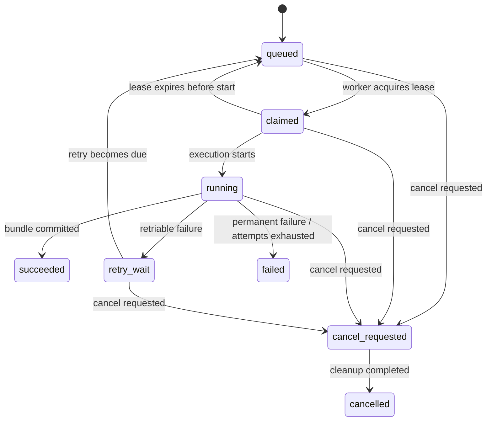

# Parse Job Lifecycle

- Status: Target specification
- Version: 1.0-draft
- Last updated: 2026-08-05

## 1. Purpose

本规格定义 StructaDoc Parse Run 的持久化状态、执行阶段、原子抢占、租约、重试、取消和崩溃恢复语义。它描述完整目标行为；具体已实现范围以本节及代码、测试为准。

当前基础实现已覆盖 Parse Run 创建与幂等返回、状态查询、Provider 配置版本快照、原子抢占、续租、未启动抢占过期恢复、`claimed → running`、失败进入 `retry-wait` 或 `failed`，以及 Host 维护 Worker 将到期重试恢复为 `queued`。Provider 执行契约、只允许当前租约持有者读取执行上下文，以及 Canonical 结果存储复核和 `running → succeeded` 幂等事务也已实现。Provider HTTP 适配、心跳编排、外部任务 ID 持久化与恢复、取消和尝试明细记录仍未实现，因此当前 Worker 不会抢占并执行解析任务。

## 2. Authority

Parse Run 是 StructaDoc 面向管理员和 API Client 的权威任务记录。Provider 外部任务状态、进程内队列和 Worker 内存都不是权威状态。

服务重启后，StructaDoc 必须能够仅凭数据库、对象存储和已保存的 Provider 外部任务 ID 恢复工作。

本规格中的 Worker 是逻辑任务执行器。第一阶段默认按 [ADR-0003](../adr/0003-technology-and-single-image-deployment.md) 作为 `BackgroundService` 运行在 StructaDoc Host 内；是否与 API 处于同一进程不改变本规格的抢占、租约、幂等和恢复要求。

## 3. Stable Status

公共状态集合：

| Status | Final | Meaning |
|---|---:|---|
| `queued` | No | 已持久化，等待 Worker 抢占 |
| `claimed` | No | 已被某个 Worker 租约占用，尚未确认开始外部处理 |
| `running` | No | 正在准备、提交、轮询、下载、归一化或持久化 |
| `retry-wait` | No | 发生可重试错误，等待下一次允许执行时间 |
| `cancel-requested` | No | 已请求取消，等待 Worker 完成 best-effort 处理 |
| `succeeded` | Yes | 统一结果已经完整持久化并可供调用方读取 |
| `failed` | Yes | 发生永久错误或重试耗尽 |
| `cancelled` | Yes | StructaDoc 已停止继续处理且不会把该次运行发布为成功结果 |

状态值一旦成为公共 API，不得在同一 API 主版本内改名或改变语义。

## 4. Diagnostic Stage

`stage` 用于显示进度和诊断，不替代稳定 `status`。第一版计划包含：

- `validating`
- `preparing-source`
- `converting`
- `submitting`
- `waiting-provider`
- `downloading`
- `normalizing`
- `persisting`
- `cleaning-up`

Stage 可以在同一 API 主版本内增加。调用方不得用 Stage 判断任务是否处于最终状态。

## 5. State Machine

Mermaid 节点中的 `retry_wait` 和 `cancel_requested` 对应 API 值 `retry-wait` 和 `cancel-requested`。

## 6. Creating a Parse Run

创建 Parse Run 时必须在同一个数据库事务中保存：

- Document ID；
- 初始状态 `queued`；
- Provider 类型、配置 ID 和配置版本；
- 不含凭据的完整解析参数快照；
- 源媒体类型和计划提交媒体类型；
- 最大尝试次数和首次可执行时间；
- 创建者、创建时间和可选幂等键。

API 返回 Parse Run ID 后，即使 API 进程立即退出，任务也不能丢失。

Provider 配置版本是不可变快照。配置更新创建新版本；旧版本在仍被非最终 Parse Run 引用时必须保持可解密和可使用。停用只阻止新任务引用该版本，不得破坏已有任务恢复。

## 7. Idempotency

- 应用调用方可以提供 `Idempotency-Key`。
- 幂等范围至少包含 API Client、目标 Document 和操作类型。
- 相同范围和 Key 的重复请求返回原 Parse Run，不重复创建外部 Provider 任务。
- 不带幂等键时，可以创建新的 Parse Run 以保留不同解析历史。
- Worker 的结果持久化必须以 Parse Run ID 和资源逻辑键幂等，允许崩溃后安全重试。

## 8. Atomic Claim and Lease

所配置的 SQLite、PostgreSQL、MySQL 或 MariaDB 是持久化任务来源。Worker 抢占需要满足：

1. 在数据库事务中选择已到执行时间的 `queued` 任务。
2. 使用条件更新、并发版本或数据库方言提供的等价原子操作，避免两个 Worker 同时成功抢占。
3. 写入 `claimedBy`、`leaseExpiresAt` 和新的执行尝试信息。
4. 提交事务后才开始网络或文件处理。

Worker 在处理期间定期续租。租约必须长于正常心跳间隔，并允许短暂数据库抖动。

任务存储实现必须提供独立于 EF Core 通用 CRUD 的抢占边界。PostgreSQL、MySQL 和 MariaDB 可以使用各自的行锁或 `SKIP LOCKED` 能力优化竞争；SQLite 可以通过短写事务和带状态、租约及并发版本谓词的 compare-and-set 更新实现。同一候选任务只有一个 Worker 的条件更新可以成功，受影响行数为零的 Worker 必须继续竞争其他任务，不能执行该任务。

SQLite 只承诺单个 StructaDoc 应用实例内的 Worker 并发，不支持多个容器共享 SQLite 文件或把数据库文件放在网络文件系统上。PostgreSQL、MySQL 和 MariaDB 必须支持多个应用实例并发抢占。不同数据库实现必须通过同一组抢占、续租、过期恢复、取消、幂等提交和竞争压力契约测试。

### Expired Lease

- `claimed` 且没有外部任务 ID：租约过期后可回到 `queued`。
- `running` 且已有外部任务 ID：新 Worker 应恢复查询现有外部任务，不得默认重新提交。
- `persisting` 阶段中断：新 Worker 执行幂等持久化和完整性检查。
- 无法确定外部任务是否已创建时，必须依赖 Provider 幂等能力或人工可诊断状态，不能盲目重复提交。

## 9. Provider Submission

提交前必须完成：

- Document 存在且未被删除；
- 文件大小、媒体类型和 Provider 能力校验；
- Provider 配置版本仍可解密和使用；
- 必要的 Office 转换及转换 Artifact 持久化；
- 在线数据传输策略允许使用当前 Provider。

Provider 返回外部任务 ID 后应立即持久化，再开始轮询。日志只能记录脱敏 ID、Provider 类型和 Parse Run ID。

## 10. Polling and Result Retrieval

- 轮询间隔应支持 Provider 建议值和指数退避，不使用无上限高频请求。
- `429`、短暂网络错误和可恢复 `5xx` 按重试策略处理。
- Provider 报告完成后，Worker 必须尽快下载结果；不能依赖 Provider 长期保存产物。
- ZIP、JSON、图片和 Markdown 下载应流式进入受限临时存储或对象存储，避免大文件全部驻留内存。
- 下载结果必须校验大小、压缩包路径、解压上限和内容类型。

## 11. Normalization and Commit

成功顺序：

1. 保存 Raw Artifacts 和 Assets，计算哈希和大小。
2. 生成统一 Parse Bundle。
3. 按 Canonical Document Model 验证 Bundle。
4. 以幂等方式写入 Pages、Blocks、Assets 和 Artifact 元数据。
5. 确认所有数据库引用指向存在且哈希匹配的存储对象。
6. 在最终数据库事务中把 Parse Run 标记为 `succeeded` 并写入 `completedAt`。
7. 提交成功后才发布 Webhook 或其他完成通知。

只要统一结果未完整持久化，Parse Run 就不能进入 `succeeded`。

对象存储写入成功但数据库提交失败时，重试应复用相同逻辑键；无法复用的对象由后续孤儿清理任务处理。

## 12. Retry Policy

### Retriable by Default

- DNS、连接中断和短暂超时；
- Provider `429`；
- Provider 或对象存储可恢复 `5xx`；
- Worker 租约丢失但已有足够状态恢复；
- 最终数据库事务的瞬时失败。

### Permanent by Default

- 不支持或损坏的文件；
- 超过配置的文件大小或页数限制；
- 无效解析参数；
- Provider 配置缺失、凭据无效或权限不足；
- 结果包结构不受支持且无法归一化；
- 安全校验失败，例如压缩包路径穿越或解压上限超限。

### Retry Record

每次尝试记录：

- attempt number；
- Worker ID；
- started/completed time；
- failure category 和稳定错误码；
- 是否会重试；
- next attempt time；
- 已脱敏的诊断摘要。

达到最大尝试次数后进入 `failed`。管理员手动重试默认创建新的 Parse Run；旧记录保持不变。

## 13. Cancellation

取消是 best-effort：

1. API 原子地把非最终任务改为 `cancel-requested`。
2. Worker 停止开始新的本地步骤。
3. Provider 支持取消时尝试取消外部任务。
4. Provider 不支持取消时，外部任务可能继续消耗资源；StructaDoc 应在界面和日志中说明。
5. 完成必要清理后标记 `cancelled`。

已进入 `succeeded`、`failed` 或 `cancelled` 的任务不能改为其他状态。取消完成的任务不会发布为成功结果，即使外部 Provider 稍后完成。

取消与成功提交并发时使用条件更新决定结果：

- 如果 `succeeded` 的最终事务先提交，后续取消请求返回该任务已完成，不改变结果；
- 如果 `cancel-requested` 先提交，Worker 的成功事务必须检测状态变化并停止发布成功结果；
- 两条路径都不能覆盖已经提交的最终状态。

## 14. Deletion Interaction

- 存在非最终 Parse Run 时，Document 删除请求必须被拒绝或转换为显式的“先取消再删除”流程。
- 删除不能让运行中的 Worker继续使用已经撤销的存储引用。
- 删除成功前应收集关联存储对象；数据库和对象存储清理必须可重试。
- 审计记录不能因业务对象删除而一并消失。

具体使用软删除还是延迟物理删除，在首个数据库设计中确定。

## 15. Observability

每条任务日志至少包含：

- Parse Run ID；
- Document ID；
- Provider 类型；
- Worker ID；
- attempt number；
- status 和 stage；
- correlation ID。

不得记录 Provider Token、预签名 URL 查询参数、原文档正文或未脱敏的 Provider 响应。

## 16. Implementation Decisions Deferred

- 具体 SQL 抢占语句和租约时长；
- 默认最大尝试次数与退避参数；
- Worker 批量大小和并发模型；
- Webhook 契约；
- 管理员对失败任务的批量操作；
- 孤儿对象清理的时间窗口。

这些参数应由实现、负载测试和真实 Provider 行为决定，不在缺少证据时写死。
