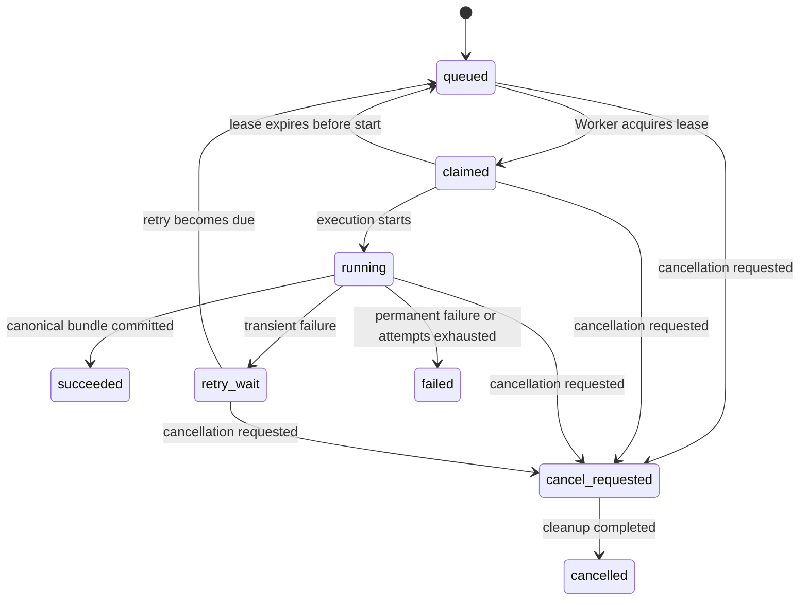

# Parse Job Lifecycle

- Status: Target specification with implemented core lifecycle
- Version: 1.0-draft
- Last updated: 2026-08-07

## 1. Purpose

This specification defines persistent Parse Run statuses, diagnostic stages, atomic claims, leases, retries, cancellation, and crash recovery.

The implementation covers creation and idempotent replay, immutable Provider snapshots, status reads, atomic claim/renewal, recovery of expired unstarted claims, `claimed → running`, retry/failure transitions, due-retry requeueing, execution snapshots restricted by a live lease, conditional stage and external-ID persistence, encrypted Cloud submission checkpoints, adoption of running external jobs, serialized heartbeat sessions, capability-driven LibreOffice fallback, bounded Provider result intake, deterministic MinerU normalization, idempotent canonical success transactions, large-PDF segment recovery, and durable cleanup jobs.

Real execution remains disabled by default with `Worker:ExecutionEnabled=false`. Upstream cancellation and richer attempt-history records remain incomplete.

## 2. Authority

The Parse Run is the authoritative job record presented to users and API clients. Provider status, an in-process queue, and Worker memory are not authoritative.

After restart, StructaDoc recovers from its database, object storage, saved external task IDs, and encrypted checkpoints. The Worker is a logical executor. It currently runs as a `BackgroundService` in the Host as defined by [ADR-0003](../adr/0003-technology-and-single-image-deployment.md), but process placement does not change claim, lease, idempotency, or recovery requirements.

## 3. Stable Status

| Status | Final | Meaning |
|---|---:|---|
| `queued` | No | Persisted and waiting for a Worker claim |
| `claimed` | No | Leased by a Worker but not yet confirmed as externally running |
| `running` | No | Validating, preparing, submitting, polling, downloading, normalizing, or persisting |
| `retry-wait` | No | A transient failure occurred; waiting until the next eligible time |
| `cancel-requested` | No | Cancellation requested; waiting for best-effort handling |
| `succeeded` | Yes | The complete canonical result is persisted and readable |
| `failed` | Yes | A permanent error occurred or retries were exhausted |
| `cancelled` | Yes | StructaDoc stopped processing and will not publish this run as successful |

Public status values cannot be renamed or change meaning within one API major version.

## 4. Diagnostic Stage

`stage` reports progress and aids diagnosis but never replaces stable status. Registered stages include:

- `validating`
- `preparing-source`
- `converting`
- `submitting`
- `waiting-provider`
- `downloading`
- `normalizing`
- `persisting`
- `cleaning-up`

Stages may be added within one API major version. Consumers determine finality from `status` only.

## 5. State Machine

Mermaid identifiers `retry_wait` and `cancel_requested` correspond to API values `retry-wait` and `cancel-requested`.

## 6. Creation

One database transaction stores:

- Document ID and initial `queued` status;
- Provider type, logical configuration ID, and immutable version ID;
- complete sanitized parsing-option snapshot;
- source and planned submitted media types;
- maximum attempts and first eligible time;
- caller, creation time, and optional idempotency key.

After the API returns a Parse Run ID, an immediate process exit cannot lose the job.

Provider versions are immutable. Updates create new versions. A version referenced by a non-final Parse Run remains decryptable and usable; disabling it only prevents new references.

## 7. Idempotency

- Callers may provide `Idempotency-Key`.
- Scope includes subject, target Document, and operation.
- A repeated key returns the original Parse Run and never creates another external task.
- Without a key, callers may create another Parse Run to preserve separate parsing history.
- Worker object writes and result commits use Parse Run identity and deterministic logical keys so crash replay is safe.

## 8. Atomic Claim and Lease

The configured SQLite, PostgreSQL, MySQL, or MariaDB database is the job source. A claim:

1. selects a due `queued` candidate;
2. uses a conditional update, concurrency version, or equivalent dialect operation so only one Worker succeeds;
3. writes `claimedBy`, `leaseExpiresAt`, and new attempt facts;
4. commits before any network or file processing begins.

Workers renew leases periodically. Lease duration is longer than the heartbeat interval and tolerates short database disruption.

Claiming remains behind a persistence boundary rather than ordinary EF Core CRUD. Server dialects may optimize with row locks or `SKIP LOCKED`; SQLite uses short write transactions and compare-and-set predicates. A zero-row update loses the claim and must not execute the candidate.

SQLite supports concurrent Workers in one StructaDoc instance only. PostgreSQL, MySQL, and MariaDB support multiple application instances. All databases pass the same claim, renewal, expiry, retry, and commit contract.

### Expired Leases

- Expired `claimed` with no external task ID returns to `queued`.
- Expired `running` with an external task ID is adopted by one new Worker and resumes polling/download.
- Expired pre-submission `running` without an external ID may return to `queued`.
- An unknown outcome during non-checkpointed `submitting` fails conservatively with `provider-submission-outcome-unknown` rather than duplicating a remote job.
- Interrupted `persisting` repeats idempotent object verification and bundle commit.
- When external-task existence is uncertain, use a durable Provider idempotency/checkpoint contract or surface a diagnosable state; never submit blindly.

## 9. Provider Submission

Before submission, verify:

- the Document exists and is not deletion-pending;
- file size, media type, and Provider capabilities;
- the captured configuration version can still be decrypted;
- any required Office conversion and its Artifact are committed;
- current policy permits external transfer to this Provider.

Persist an external task ID immediately under the live lease. Logs contain only safe Parse Run, Provider, and sanitized task identifiers.

For a two-step protocol, persist the external allocation plus encrypted continuation before uploading. A crash then resumes the same allocation instead of creating another task.

## 10. Polling and Result Retrieval

- Bound polling by configured minimum/maximum intervals and Provider recommendations; never busy-poll without limit.
- Treat `429`, temporary network failure, and recoverable `5xx` according to retry policy.
- Download promptly when the Provider reports completion; do not depend on long Provider retention.
- Stream ZIP, JSON, images, and Markdown into bounded temporary or object storage.
- Validate content type, archive paths, compressed bytes, entry counts, expanded bytes, and compression ratios.
- Once a valid archive is stored, recovery normalizes from that object without another Provider download.

## 11. Normalization and Commit

Success occurs in this order:

1. retain Raw Artifacts and Assets and compute size/hash;
2. build a canonical Parse Bundle;
3. validate it against the Canonical Document Model;
4. verify every referenced object and write Pages, Blocks, Assets, and Artifact metadata idempotently;
5. in one final database transaction, write the complete result and change the Parse Run to `succeeded` with `completedAt`;
6. publish any future completion notification only after commit.

A run cannot be `succeeded` while canonical data is incomplete. If object storage succeeds and database commit fails, retry reuses the same logical keys; later orphan reconciliation handles objects that never obtained a database reference.

Large PDFs use deterministic segment identities and stored per-segment stages/checkpoints. The parent succeeds only after all segments normalize and merge into one globally ordered bundle.

## 12. Retry Policy

### Retriable by Default

- DNS, connection interruption, and temporary timeout;
- Provider `429`;
- recoverable Provider or storage `5xx`;
- recoverable state after a lost lease;
- transient final database transaction failure.

### Permanent by Default

- unsupported, corrupt, or unrecognizable input;
- configured size/page limits exceeded, including an indivisible oversized PDF page;
- invalid parsing options;
- missing configuration, invalid credential, or insufficient Provider permission;
- unsupported result structure that cannot normalize;
- security failure such as path traversal, private signed-transfer target, or archive expansion violation.

### Attempt Records

The target attempt record contains attempt number, Worker ID, start/completion time, failure category/code, retry decision, next eligible time, and sanitized diagnosis. The core lifecycle currently persists aggregate attempt and retry facts; a richer independently queryable attempt history remains future work.

After maximum attempts, status becomes `failed`. Manual retry normally creates a new Parse Run and preserves the old record.

## 13. Cancellation

Cancellation is best-effort:

1. atomically change a non-final run to `cancel-requested`;
2. stop beginning new local steps;
3. request upstream cancellation when supported;
4. explain that unsupported Providers may continue consuming resources;
5. finish required cleanup and mark `cancelled`.

Final statuses never transition. A success/cancellation race uses conditional updates: whichever transition commits first wins, and neither path overwrites an existing final state.

The complete upstream cancellation path remains an implementation gap because the current MinerU protocols do not expose a stable single-task cancellation contract.

## 14. Deletion Interaction

- A Document with non-final Parse Runs cannot enter deletion.
- A non-final Parse Run cannot be deleted.
- Execution never continues with a revoked storage reference.
- Deletion marks resources pending and snapshots all objects into a persistent Cleanup Job.
- Cleanup retries object deletion and removes relational rows only after objects are gone.
- Audit facts must survive according to the audit retention policy rather than disappearing accidentally with business rows.

## 15. Observability

Task logs include safe values for:

- Parse Run ID;
- Document ID;
- Provider type;
- Worker ID;
- attempt number;
- status and stage;
- correlation ID.

Never log Provider tokens, OIDC tokens, storage credentials, presigned URL queries, document content, or unsanitized Provider responses.

## 16. Evolution Work

- upstream cancellation integration when a stable contract exists;
- independently queryable attempt history;
- webhook contracts;
- bulk administrator operations;
- broader contention/stress testing and orphan-reconciliation scheduling;
- role-based API-only/Worker-only startup modes for the same image.

These additions must preserve current status, lease, idempotency, and recovery semantics.
